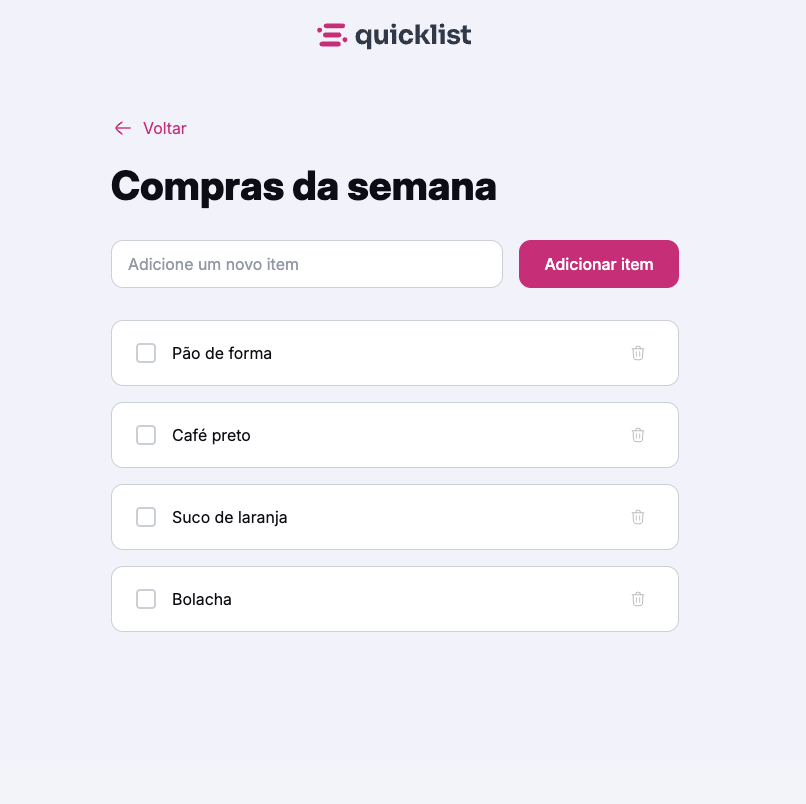

# 📝 Quicklist - Lista de Tarefas



Um aplicativo web simples e intuitivo para gerenciar listas de tarefas, desenvolvido como parte dos estudos do curso **Fullstack da Rocketseat**.

## 📋 Sobre o Projeto

O **Quicklist** é uma aplicação de lista de compras/tarefas que permite aos usuários:

- ✅ Adicionar novos itens à lista
- ☑️ Marcar itens como concluídos
- 🗑️ Remover itens da lista com feedback visual
- 📱 Interface responsiva e moderna

## 🚀 Funcionalidades

- **Adicionar Items**: Digite um novo item no campo "Adicione um novo item" e clique em "Adicionar item"
- **Marcar como Concluído**: Use os checkboxes para marcar itens completados
- **Remover Items**: Clique no ícone da lixeira para deletar itens
- **Feedback Visual**: Popup de confirmação que aparece na parte inferior da tela quando um item é removido
- **Design Responsivo**: Interface adaptável para diferentes tamanhos de tela

## 🛠️ Tecnologias Utilizadas

- **HTML5** - Estrutura semântica da aplicação
- **CSS3** - Estilização modular e layout responsivo
- **JavaScript (ES6+)** - Interatividade e manipulação do DOM
- **Google Fonts (Inter)** - Tipografia moderna

## 📁 Estrutura do Projeto

```
lista-de-tarefas/
├── index.html          # Página principal
├── scripts.js          # Lógica JavaScript
├── css/
│   ├── index.css      # Imports dos estilos
│   ├── global.css     # Estilos globais
│   ├── main.css       # Estilos principais
│   └── popup.css      # Estilos do popup
└── assets/
    ├── logo.svg       # Logo do Quicklist
    ├── seta.svg       # Ícone de voltar
    └── bin.svg        # Ícone da lixeira
```

## 🎯 Como Usar

1. **Clone este repositório**
   ```bash
   git clone <url-do-repositorio>
   ```

2. **Navegue até a pasta do projeto**
   ```bash
   cd "lista de tarefas"
   ```

3. **Abra o arquivo index.html em seu navegador**
   - Duplo clique no arquivo `index.html`
   - Ou use um servidor local como Live Server (VS Code)

4. **Comece a usar:**
   - Digite um item no campo de entrada
   - Clique em "Adicionar item" para adicionar à lista
   - Use os checkboxes para marcar como concluído
   - Clique na lixeira para remover itens

## 💡 Funcionalidades Técnicas

### JavaScript
- Event delegation para gerenciar eventos de elementos criados dinamicamente
- Manipulação do DOM com `createElement` e `appendChild`
- Prevenção de comportamentos padrão com `preventDefault()`
- Criação de popups dinâmicos com auto-remoção

### CSS
- Arquitetura CSS modular com imports
- Animações CSS (slideUp) para melhor UX
- Layout responsivo
- Sistema de cores consistente

## 🎓 Contexto Educacional

Este projeto foi desenvolvido como parte dos estudos do **curso Fullstack da Rocketseat**, focando em:

- ✨ Fundamentos de JavaScript moderno
- 🎨 CSS modular e responsivo
- 🔄 Manipulação avançada do DOM
- 📱 Desenvolvimento de interfaces interativas
- 🎯 Event Listeners e delegação de eventos
- 💫 Animações e transições CSS
- 🧩 Arquitetura de código limpo e organizado

## 🚀 Possíveis Melhorias

- [ ] Persistência de dados com localStorage
- [ ] Drag and drop para reordenar itens
- [ ] Categorias de itens
- [ ] Dark mode
- [ ] PWA (Progressive Web App)

## 👨‍💻 Desenvolvedor

Desenvolvido com 💜 durante os estudos na **Rocketseat**

---

*Este é um projeto educacional criado para praticar os fundamentos de desenvolvimento web fullstack.*

## 📄 Licença

Este projeto é para fins educacionais e está sob a licença MIT.
